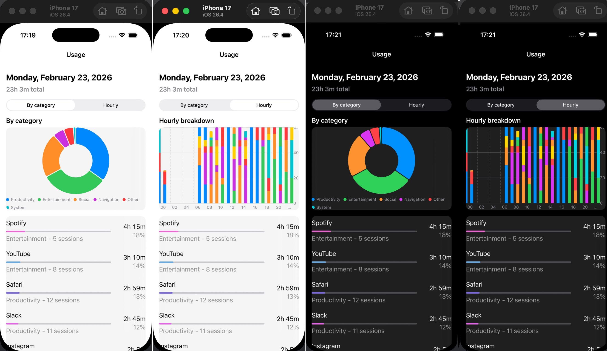

# DataUsageChart

A single-screen iOS app that visualizes app usage data for a given day, similar in concept to [StayFree](https://stayfree.app/). Built for the assignment:

> Your goal is to create some UI around the attached usage data sample. This is similar to the StayFree app itself (though the iOS StayFree app is unpolished). Please build a **single-screen iOS UI** for the data from **February 23, 2026**. Feel free to use whatever tools and charting libraries you wish; I'll leave the majority of the UI details up to you.



## Features

- **Single screen** showing usage for **February 23, 2026**
- **Header** with formatted date and total screen time (e.g. “Monday, February 23, 2026” and “Xh Ym total”)
- **Segmented control** to switch between two chart types:
  - **By category** — pie chart of time by category (Social, Productivity, Entertainment, Other, etc.)
  - **Hourly** — stacked bar chart of usage by hour (0–23) per app
- **App list** — ranked list of apps with progress bar, category, session count, duration, and share of total time
- **Error state** with retry when data fails to load
- **Loading state** while data is fetched

Data is read from a bundled JSON sample (`mock-data.json`). Sessions with `category: null` are treated as **Other**.

## Tech stack

- **SwiftUI** for the UI
- **Swift Charts** (Apple) for the pie and bar charts
- **iOS 17.6+** (Xcode 26.x / Swift 6)
- No third-party charting or UI libraries

## Requirements

- Xcode 26.x (or current Xcode that supports the project’s deployment target)
- iOS 17+ device or simulator

## How to run

1. Clone the repo and open `DataUsageChart.xcodeproj` in Xcode.
2. Select the **DataUsageChart** scheme and an iOS 18+ simulator or device.
3. Build and run (⌘R).

The app loads usage from `DataUsageChart/Resources/mock-data.json` and displays the February 23, 2026 view.

## Project structure

```
DataUsageChart/
├── App/                    # App entry point
├── Data/                   # Repository (loads JSON sessions)
├── Domain/                 # UsageAggregator (sessions → daily usage, categories, row items)
├── Model/                  # Session, DailyUsage, SessionCategory, AppUsageRowItem, CategorySlice, etc.
├── ViewModel/              # UsageViewModel (load state, derived data)
├── Views/                  # DataUsageChartView, AppUsageRowView, ErrorStateView
│   └── Charts/             # CategoryPieChartView, HourlyUsageBarChartView
├── Extensions/             # Int+hoursMinutes, Color+appColor, String+hex
└── Resources/              # mock-data.json
```

Data flow: **Repository** loads `[Session]` from JSON → **ViewModel** runs aggregation once (daily usage, category slices, app row items) → **View** reads published values and renders the charts and list.

## Data format

The app expects JSON in this shape (array of session objects):

- `session_id` (string)
- `app_name` (string)
- `category` (string or `null`; null is shown as “Other”)
- `start_timestamp`, `end_timestamp` (ISO 8601, e.g. `"2026-02-23T09:35:00Z"`)

Only sessions that overlap the target day (2026-02-23) are included; minutes are clipped to that day for totals and hourly breakdown.

## License

This project was created for an assignment. Use and modify as needed.
